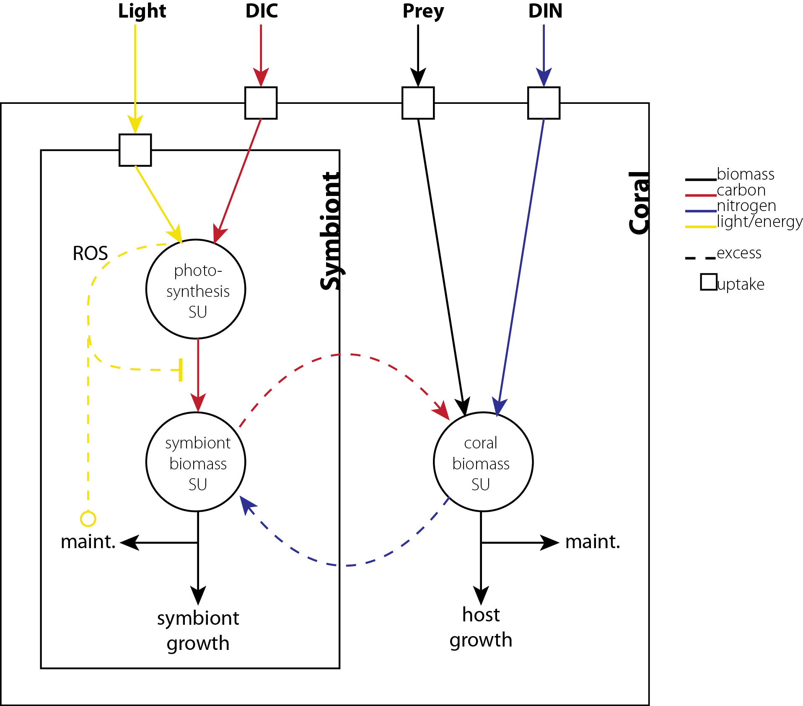

```{r setup, include=FALSE}
library(reshape2); library(dplyr)
knitr::opts_knit$set(root.dir = normalizePath(".."))
```

```{r load, include=FALSE}
# Source default parameters and functions
sapply(list.files(path="../../R", pattern="^[^F].*.R", full.names=T), source, .GlobalEnv)
```

# Introduction

The nutritional exchange between corals and *Symbiodinium* directly underlies the capacity of corals to build coral reef ecosystems, worth trillions of US Dollars annually [@Costanza:2014ex]. However, the complex symbiotic metabolism of corals is vulnerable to disruption by numerous anthropogenic environmental perturbations, jeopardizing their future persistence. In order to understand and predict coral responses to complex changes in the environment, a mechanistic understanding of how multiple interacting factors drive the individual and emergent physiology of both symbiotic partners is necessary. Such a task is well suited for theoretical modeling frameworks such as Dynamic Energy Budget (DEB) theory [@Kooijman:2010vd], although the complexity of such theory makes these efforts inaccessible to many biologists [@Jager:2013bj]. In order to bridge this gap, we present here a simplified dynamic bioenergetic model for coral-*Symbiodinium* symbioses that aims to mechanistically integrate the impacts of complex environmental change on the physiological ecology of reef corals.

In reef coral symbioses, intracellular *Symbiodinium* translocate photosynthetically-fixed carbon to support coral metabolism, and utilize the animal’s metabolic waste products, including nitrogenous compounds and carbon dioxide, in return [@Muscatine:1977p4220]. Previous application of DEB theory to this syntrophic system [@Muller:2009io] demonstrated a stable symbiotic relationship and qualitatively realistic growth and biomass ratios across gradients of ambient irradiance, nutrients, and food. This model assumed that 1) *Symbiodinium* has priority access to carbon through photosynthesis, 2) the coral animal has priority access to dissolved nitrogen through contact with seawater, and 3) each partner shares with the other only what it cannot use itself. In its simplest form, this principle of sharing the surplus sufficiently describes diverse syntrophic interactions among organs and organisms (e.g., trees, duckweeds, corals), suggesting the mechanism is mathematically and evolutionarily robust (Nisbet et al., submitted).

While the work of @Muller:2009io applying DEB formalism to this system represents the most significant theoretical contribution in coral symbiosis research to date, we aim to strengthen the role of theory and broaden its potential application to corals in three primary ways:

1. _Develop a detailed module of environmental stress._ Of primary interest to coral biologists and ecologists is symbiosis dysfunction under environmental stress, resulting in coral “bleaching”--the loss of algal symbionts from the association [@Jokiel:1977p7353]. Photooxidative stress in *Symbiodinium* is considered a primary trigger of bleaching in response to high temperature and/or light [@Weis:2008p944], and prolonged or severe bleaching can result in mortality, though corals sometimes recover their symbionts. Bleaching susceptibility, severity, and recovery may by influenced by interacting factors such as heterotrophy and nutrient availability [@Wooldridge:2014hc], and the genetic identity of *Symbiodinium* [@Glynn:2001p7571]. To simulate these bleaching-related phenomena, we develop a generalized framework linking overreduction of the photosynthetic light reactions to downstream impacts of photoinhibition and photodamage.

2. _Reduce theoretical and mathematical complexity._ Following the logic of @Jager:2013bj, we exclude certain features of formal DEB models in order to capture behaviors of interest with the simplest possible formulation. Here, we present a model without reserves, maturity, or reproduction [see @Kooijman:2010vd]. This formulation restricts the model's scope to the bioenergetics of growth and symbiosis dynamics in adult corals, but greatly reduces theoretical complexity and parameter numbers, which is advantageous given the relative paucity of data for corals. However, our primary motivation for reducing complexity was to increase accessibility and applicability for biologists and ecologists without requiring significant expertise in DEB theory.

3. _Provide well-documented, open-access code._ In order to facilitate the continued development and application of theoretical modeling tools for coral symbioses, we provide open access to the model in the form of detailed, commented code written in the R language [@RALanguageandEn:2014wf]. With an accessible and modular framework, we envision this as a resource for futher development by the scientific community to include additional complexity and problem-specific components. The R language was chosen because it is freely available and in common use by biologists and ecologists, to widen the audience for this work.

With these as our primary motivations, we describe a simplified approach to dynamic bioenergetic modeling of coral-algal symbioses that tracks carbon and nitrogen acquisition and sharing between partners. This theoretical framework dynamically integrates the influence of external irradiance, nutrients, and prey availability on coral growth and symbiosis dynamics (i.e., symbiont:host biomass ratios), allowing for the possibility of coral bleaching in the event of photooxidative stress. In the following sections, we describe the formulation of this model and justify its structure and parameter values based on relevant literature. We then demonstrate the model's behavior and discuss some of its major implications and outcomes, and the wide range of potential applications for this model in the study of cnidarian-algal symbioses.

# Model description
In this model of coral-algal symbiosis, carbon and nitrogen are acquired by each partner and used to construct biomass. A graphical representation of the model is presented in Fig. 1. We use C-moles as the unit of biomass for consistency with the rigorous mass balance of DEB theory: 1 C-mole is equivalent to the amount of biomass containing 1 mole of Carbon atoms. Host biomass ($H$), symbiont biomass ($S$), and prey biomass ($X$) have fixed, but different, molar N:C ratios (Table 1). Carbon and nitrogen are combined to produce biomass by synthesizing units (SU), which are mathematical specifications of the formation of a product from two substrates; we use the "parallel complementary" formulation of @Kooijman:2010vd to specify these fluxes. The two state variables in this dynamical system are symbiont biomass and coral biomass; because resources are acquired proportionally to surface area (and surface area is assumed proportional to volume for corals (i.e., they are "V1-morphs" in DEB terminology [@Kooijman:2010vd])), biomass increases exponentially during growth. The rate of increase in coral biomass (i.e. growth) and the ratio of symbiont to host biomass are the (i.e. symbiosis dynamics) are the responses of interest of the system. Below we describe the formulation of each flux involved in producing these responses.

Table 1

| Symbol  | Description                            | Value  | Units              |
| ------- | -------------------------------------- | ------ | ------------------ |
| $n_{NH}$ | N:C molar ratio in host biomass | 0.19 | -- |
| $n_{NS}$ | N:C molar ratio in symbiont biomass | 0.2 | -- |
| $n_{NX}$ | N:C molar ratio in prey biomass | 0.13 | -- |
| $j_{HT}^0$ | Specific turnover rate of host biomass | 0.03 | d^-1^ |
| $j_{ST}^0$ | Specific turnover rate of symbiont biomass | 0.03 | d^-1^ |
| $\sigma_{NH}$ | Proportion host nitrogen turnover recycled | 0.9 | -- |
| $\sigma_{CH}$ | Proportion host carbon turnover recycled | 0.9 | -- |
| $\sigma_{NS}$ | Proportion symbiont nitrogen turnover recycled | 0.9 | -- |
| $\sigma_{CS}$ | Proportion symbiont carbon turnover recycled | 0.9 | -- |
| $j_{Xm}$ | Maximum specific feeding rate of host | 0.1292 | molX CmolH^-1^ d^-1^ |
| $K_X$ | Half-saturation constant for prey uptake by host | 20e-6 | molX L^-1^ | 
| $j_{Nm}$ | Maximum specific DIN uptake rate by host | 0.048 | molN CmolH^-1^ d^-1^ |
| $K_N$ | Half-saturation constant for DIN uptake by host | 0.46e-6 | molN L^-1^ | 
| $j_{CO_2}^p$ | Passive CO~2~ delivery to symbiont | 4.04e-3 | molC CmolH^-1^ d^-1^ |
| $j_{CO_2}^a$ | Active CO~2~ delivery to symbiont | 0.32--18.0 | molC CmolH^-1^ d^-1^ |
| $j_{HGm}$ | Maximum specific growth rate of host | 1 | d^-1^ |
| $n_{LC}$ | Quantum yield of photosynthesis | 0.1 | molC mol ph^-1^ |
| $\bar{a}^*$ | Effective light-absorbing cross-section of symbiont | 1.34 | m^2^ CmolS^-1^ |
| $k_{NPQ}$ | NPQ capacity of symbiont, relative to C-fixation | 4 | -- |
| $k_{ROS}$ | Excess photon energy that doubles ROS prod. | 40-80 | mol ph CmolS^-1^ d^-1^ |
| $k$ | Exponent on ROS production rate | 1 | -- |
| $j_{CPm}$ | Maximum specific photosynthesis rate of symbiont | 2.8 | molC CmolS^-1^ d^-1^ |
| $j_{SGm}$ | Maximum specific growth rate of symbiont | 0.25 | d^-1^ |

Also include tables of fluxes and environmental inputs?



## Coral animal fluxes

The coral animal acquires both carbon and nitrogen from feeding on prey from the environment. Prey acquisition is specified by Michaelis-Menten kinetics using a maximum area-specific feeding rate and half-saturation constant:

\begin{equation} j_X = {{j_{Xm} \cdot X} \over {X + K_X}} \end{equation}

Additionally, the coral animal can acquire nitrogen from the surrounding seawater. This nitrogen source is assumed to represent ammonium, the primary form utilized by corals [@Wang:1998p128; @Yellowlees:2008p331]. The uptake of nitrogen from the environment is specified by Michaelis-Menten kinetics using a maximum area-specific uptake rate and half-saturation constant:

\begin{equation} j_N = {{j_{Nm} \cdot N} \over {N + K_N}} \end{equation}

Coral biomass formation is specified by a parallel complementary SU that combines carbon and nitrogen to form biomass. In addition to the carbon and nitrogen acquired by direct uptake (Eqs. 1 and 2), the coral recycles a portion of the nitrogen liberated by biomass turnover ($r_{NH}=\sigma_{NH}j_{HT}^0$), and receives surplus fixed carbon shared by the symbiont ($\rho_C$), such that the total biomass formation is specified as:

\begin{equation} j_{HG} = \bigg({1 \over j_{HGm}} + {1 \over {\rho_C{S \over H} + j_X}} + {1 \over {(j_N + n_{NX}j_X + r_{NH}) / n_{NH}}} - {1 \over {{\rho_C{S \over H} + j_X} + (j_N + n_{NX}j_X + r_{NH}) / n_{NH}}}\bigg)^{-1} \end{equation}

The amount of nitrogen input to the coral biomass SU in excess of what is actually consumed in biomass formation (i.e., surplus nitrogen, or the "rejection flux" in SU terminology) is then made available to the symbiont, and is specified as:

\begin{equation} \rho_N = (j_N + n_{NX}j_X + r_{NH} - n_{NH}j_{HG})_+ \end{equation}

Due to the inherent inefficiency of the parallel complementary SU formulation, there will always be some nitrogen shared with the symbiont even when coral biomass formation is strongly nitrogen-limited. Likewise, there is always a non-zero rejection flux of carbon from the coral biomass SU, which is assumed to be lost to the environment.

## *Symbiodinium* fluxes

The symbiont produces fixed carbon through photosynthesis, a process represented here by a single SU with two substrates: light (photons) and inorganic carbon (CO~2~). The amount of light absorbed by the symbiont depends on the scalar irradiance at the site of light absorption, which is modified substantially relative to external downwelling irradiance owing to multiple scattering by the coral skeleton and self-shading by surrounding symbionts [@Enriquez:2005p142; @Marcelino:2013hz]. We used data from @Marcelino:2013hz to empirically derive the ratio of internal scalar irradiance to external downwelling irradiance as a function of symbiont density (expressed as symbiont to host biomass ratio), and subsequently multiply this quantity by the external downwelling irradiance $L$ and the effective light-absorbing surface area of symbiont biomass $ds$ to specify the amount of light absorbed:

\begin{equation} j_L = \big[1.26 + 1.39 \cdot \exp(-6.48 \cdot {S \over H})\big] \cdot L \cdot \bar{a}^* \end{equation}

We then specify two pathways for input of inorganic carbon to the photosynthesis SU: 1) passive diffusion of CO~2~ from the external environment, and 2) active delivery of CO~2~ to the symbiont by the host. The passive flux ensures that some CO~2~ is always available to photosynthesis, and the active flux encompasses the potentially diverse mechanisms by which the host may enhance CO~2~ availability for the symbiont, including active transport of bicarbonate, carbonic anhydrase-catalyzed conversion of bicarbonate to CO~2~ to promote diffusion toward the symbiont, and acidification of the symbiosome to increase localized CO~2~ concentrations. Since the host physically separates the symbiont from the external environment, both the passive and active flux rates are proportional to host surface area. A more rigorous, mechanistic model of inorganic carbon processing would require spatially explicit internal pools accounting for pH and carbon speciation, which is beyond the current scope of this work. Instead, the specification of CO~2~ delivery rates offers the user the opportunity to compare different rates of CO~2~ delivery that may characterize different coral species [@Wooldridge:2014di]. The input of CO~2~ to the photosynthesis SU is therefore specified as:

\begin{equation} j_{CO_2} = j_{CO_2}^p + j_{CO_2}^a \end{equation}

In addition to the inputs CO~2~ specified in Eqs. 7, additional CO~2~ representing the metabolic production of CO~2~ from host and symbiont biomass turnover ($r_{CH}=\sigma_{CH}j_{HT}^0; r_{CS}=\sigma_{CS}j_{ST}^0$) is made available to the photosynthesis SU. fixed carbon is produced by the photosynthesis SU according to:

\begin{equation} j_{CP} = \bigg({1 \over j_{CPm}} + {1 \over {n_{LC} j_L }} + {1 \over {(j_{CO_2} + r_{CH}){H \over S} + r_{CS}}} - {1 \over {n_{LC} j_L + (j_{CO_2} + r_{CH}){H \over S} + r_{CS}}}\bigg)^{-1} \cdot c_{ROS}^{-1} \end{equation}

where $j_{CPm}$ is the maximum specific rate of photosynthesis, and $c_{ROS}$ is the photooxidative stress multiplier (see below). Dividing by $c_{ROS}$ causes the rate of photosynthesis to decline in response to photo-oxidative stress, a phenomenon known as photoinhibition.

Light energy absorbed in excess of what is used to fix carbon is specified by the SU "rejection flux", according to:

\begin{equation} j_{eL} = (j_L - j_{CP} / n_{LC})_+ \end{equation}

This excess light energy must be quenched by alternative pathways in order to prevent photo-oxidative damage. *Symbiodinium* may utilize a variety of pathways for non-photochemical quenching [NPQ; @Roth:2014wf], which we collect in a total capacity for NPQ as a parameter of the symbiont ($k_{NPQ}$). If light energy exceeds the total capacity of both carbon fixation and NPQ, then damaging reactive oxygen species (ROS) may be produced. We represent this as a scaled flux of ROS $c_{ROS}$, which takes a value of 1 when all light absorbed is quenched by photochemistry and NPQ, and increases as the amount of excess excitation energy increases. 

\begin{equation} c_{ROS} = 1 + \bigg[\bigg({{j_{eL} - j_{NPQ}} \over k_{ROS}}\bigg)^k\bigg]_+ \end{equation}

where $k_{NPQ}$, $k_{ROS}$, and $k$ are parameters of the symbiont that determine the onset and rate of ROS production. Importantly, $c_{ROS}$ as specified here is not a function of absolute light absorption, but rather the amount of excess light energy $j_{eL}$ after accounting for carbon fixation and NPQ. A direct consequence of this formulation is that carbon-limitation of photosynthesis can lead to photo-oxidative stress, a mechanism of biological importance [@Wooldridge:2009p7807] that was not captured by previous representations of photo-oxidative stress [@Eynaud:2011tv]. Moreover, this formulation allows functional diversity among symbiont types to be explored by changing the parameters $k_{NPQ}$, $k_{ROS}$, and $k$.

Carbon fixed by photosynthesis ($j_{CP}$) is then used in conjunction with nitrogen shared by the host ($\rho_N$) and a proportion of nitrogen recycled from symbiont biomass turnover ($r_{NS}=\sigma_{NS}j_{ST}^0$) to build new symbiont biomass, following the SU equation:

\begin{equation} j_{SG} = \bigg({1 \over j_{SGm}} + {1 \over j_{CP}} + {1 \over {(\rho_N{H \over S} + r_{NS}) / n_{NH}}} - {1 \over {j_{CP} + (\rho_N{H \over S} + r_{NS}) / n_{NH}}}\bigg)^{-1} \end{equation}

The rejection flux of carbon from this SU represents the amount of fixed carbon produced by photosynthesis in excess of what can be used to produce symbiont biomass; this surplus $\rho_C$ is translocated to the coral host:

\begin{equation} \rho_C = (j_{CP} - j_{SG})_+ \end{equation}

The rejection flux of nitrogen from the symbiont biomass SU is lost to the environment. 

Symbiont biomass turnover includes a component of constant turnover specified by the parameter $j_{ST}^0$, representing fixed maintenance costs, plus a component that scales with the magnitude of ROS production. 

\begin{equation} j_{ST} = j_{ST}^0(1 + 5 \cdot (c_{ROS}-1)) \end{equation}

This second component of symbiont biomass loss can represent both photodamage and/or symbiont expulsion (i.e., bleaching), both of which happen in response to higher levels or ROS production. The constant 5 is included to increase biomass loss in response to ROS. (Note that recycling of symbiont biomass turnover ($rNS$ and $rCS$) only occurs based on the basal maintenance related turnover (i.e., $j_{ST}^0$), and not the bleaching-related biomass loss, as this loss represents biomass being damaged or being expelled from the holobiont). 

## Model state equations
Finally, the balance equations representing the specific growth rates of symbiont and host biomass over time can be expressed as:

\begin{equation} {dS \over Sdt} = j_{SG} - j_{ST} \end{equation}

\begin{equation} {dH \over Hdt} = j_{HG} - j_{HT}^0 \end{equation}

## Numerical analysis

A time-stepping Euler method was used to solve the state equations since the production and rejection fluxes of the SUs are imiplicitly defined. Specifically, the rejection fluxes of carbon and nitrogen from the symbiont and host biomass SUs act as reciprocal input fluxes to the other SU. In addition, the rejection flux of excitation energy from the photosynthesis SU acts to reduce its own production flux (i.e., photoinhibition), and hence a discretized time-stepping procedure was necessary. A vector of time values was created for each simulation run, along which dynamic environmental forcing functions (irradiance, DIN, and prey abundance) can be designed. These vectors, along with initial values of symbiont and host biomass, then serve as input to the time-stepping function, which solves for the current system state using values of the previous system state where necessary. A default time step of 0.1 days was used for all simulations, which were performed using R code that is available in the data repository accompanying this article: [github.com/jrcunning/Rcoral](github.com/jrcunning/Rcoral). 

To aid in visualizing model results, we calculated values to indicate the degree to which product formation at an SU was limited by availability of either of its two substrates

\begin{equation} \log \bigg({{\min(j_{S1}, j_{Pm})} \over {\min(j_{S2}, j_{Pm})}}\bigg) \end{equation}

where $j_{S1}$ and $j_{S2}$ are the specific input fluxes of the two substrates and $j_{Pm}$ is the maximum specific product formation rate, all with units of Cmol Cmol^-1^ d^-1^.

# Model behavior evaluation

To analyze qualitative behavior, we ran the model to steady state across gradients of external irradiance and nutrients (Fig. 2), which revealed patterns that are consistent with observed phenomena in corals. 

_Specific growth rates_ are low at low light and DIN (~0.01-0.03 d^-1^), and begin increasing as both of these factors increase (Fig. 2A). Higher light alleviates light-limitation of photosynthesis (Fig. 2D), and consequently carbon-limitation of host growth (Fig. 2B). Similarly, elevated DIN alleviates nitrogen-limitation of host growth (Fig. 2B), a trend that was also predicted by the DEB model of @Muller:2009io, and has been observed experimentally [@MullerParker:1994uo; @Tanaka:2013dj]. Very high nutrient levels may have negative direct and indirect impacts on growth [@Shantz:2015dz], though these are not likely to occur until beyond the range of concentrations considered here [@FerrierPages:2000p1950]. The maximum specific growth rates of ~0.09 d^-1^, occurring between ~10-15 mol photons m^-2^ s^-1^ light and >1 µM DIN, are an order of magnitude higher than those typically observed for corals [@Osinga:2011kq]. The primary reasons for this overestimation of host growth are 1) the model does not account for calcification, and 2) it does not account for size-dependent reductions in growth that likely occur as individual polyps and/or colonies grow (Sebens1980?, probably better refs)... (i.e., the system continues growing exponentially in this model). However, the estimated specific growth rates are consistent with rates of biomass increase in *Aiptasia*, measured at 0.04 d^-1^ [@ArmozaZvuloni:2014ju], suggesting they are biologically realistic. They also match the values predicted by the full DEB model of @Muller2009:io. Furthermore, the relative differences across environmental gradients are likely to be the same.

As irradiance continues to increase above ~15-20 mol photons m^-2^ d^-1^, growth rates decline until the symbiosis is no longer viable above ~30 µmol photons m^-2^ d^-1^. The mechanism underlying this breakdown is the production of ROS caused by excitation energy in excess of what can be quenched by symbiont photosynthesis and non-photochemical quenching. ROS production has the consequence of increasing symbiont biomass loss (photodamage) and decreasing photosynthesis rates (photoinhibition), which have the net effect of reducing fixed carbon input to the system below levels necessary to sustain the symbiosis.

_Symbiont to host biomass ratios_ at low DIN (e.g. <1 µM) and high light (e.g., ~20 mol ph m^-2^ d^-2^) typical of coral reef environments are around ~0.1-0.3, which are consistent with values reported in the literature (@Muscatine:1981jy; @Edmunds:2011bv). S:H ratios increase under higher nutrients () and lower light (). 

_

![Steady state values of **A)** specific growth (Cmol Cmol^-1^ d^-1^), **B)** the symbiont to host biomass ratio (CmolS CmolH^-1^), **C)** relative C- or N-limitation of host biomass formation, and **D)** relative CO~2~- or light-limitation of symbiont photosynthesis, across gradients of external irradiance and dissolved inorganic nitrogen. Simulations for each combination of light and nutrients (41 points along each axis) were run for 120 days with a time step of 1 day. Negative steady state growth rates, and corresponding S:H ratios, were set to zero.](../img/Fig2.png)


# More things to show:
## varying light: consequences of excess light and light-limitation
## varying DIN: role of N-limitation and consequences of elevated N
## elevated nutrients cause system to become C-limited (photo: CO2 limited; host: fixed C limited)
## C-limitation increases susceptibility to bleaching
## consequences of a less efficient but more tolerant symbiont
## Rate of symbiont repopulation (Berner et al. 1993)
## Bicarbonate addition promotes coral growth (Marubini and Thake 1999)

References {#references .unnumbered}
==========
