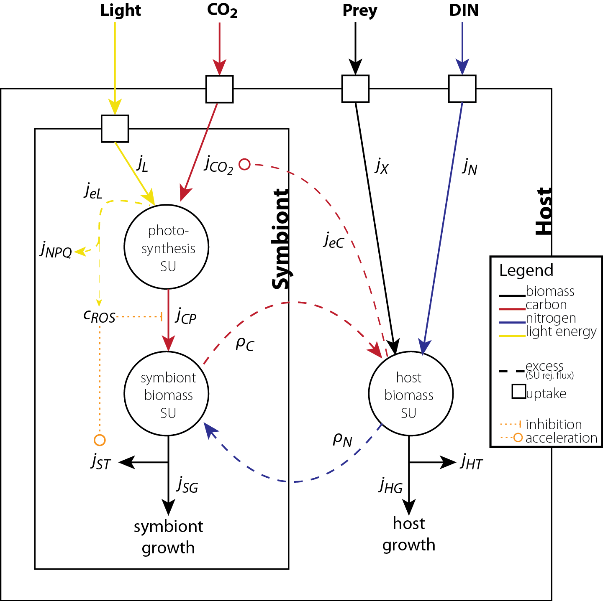

```{r setup, include=FALSE}
knitr::opts_knit$set(root.dir = normalizePath(".."))
knitr::opts_chunk$set(message = F, warning = F)
```

```{r initialize, include=FALSE}
# Source default parameters and functions
sapply(c("R/conversions.R", "R/def_pars.R", "R/init_env.R", "R/plot_results.R",
         "R/run_coral.R", "R/run_coral_ss.R", "R/sym_PI.R", "R/run_steady_states.R", "R/plot_steady_states.R",
         "R/explore_NPQ.R"), source, .GlobalEnv)
```




### Steady states values with default parameters - no feeding
```{r ss, cache=T, fig.width=5, fig.height=4.4}
# Set parameters
defpars <- def_pars()  # Get default parameters

# Set values of L and N at which to get steady state values
at <- expand.grid(L=seq(from=0, to=60, length.out=21),
                  N=seq(from=0, to=4e-6, length.out=21))

# Run to steady state and plot results
ssdat <- run_steady_states(pars=replace(defpars, c("initS", "kCO2"), c(1, 10)), at=at, food=0, runtime=T)
plot_steady_states(ssdat)
```
With default parameters, steady state values of specific growth are higher than usually observed in corals (skeletal growth), but patterns across environments are consistent with literature. 

```{r ss_feeding, cache=T, fig.width=5, fig.height=4.4, eval=F, include=F}
# Set parameters
defpars <- def_pars()  # Get default parameters

# Set values of L and N at which to get steady state values
at <- expand.grid(L=seq(from=0, to=60, length.out=21),
                  N=seq(from=0, to=4e-6, length.out=21))

# Run to steady state and plot results
ssdat <- run_steady_states(pars=defpars, at=at, food=5e-6, runtime=T)
plot_steady_states(ssdat)
```
With default parameters, steady state values of specific growth are higher than usually observed in corals (skeletal growth), but patterns across environments are consistent with literature. 

### Steady states values with default parameters - + tolerant symbiont
```{r ss_tolerant, cache=T, fig.width=5, fig.height=4.4}
# Set parameters
defpars <- def_pars()  # Get default parameters

# Set values of L and N at which to get steady state values
at <- expand.grid(L=seq(from=0, to=60, length.out=21),
                  N=seq(from=0, to=4e-6, length.out=21))

# Run to steady state and plot results
ssdat <- run_steady_states(pars=replace(defpars, c("initS", "kROS", "kCO2"), c(1, 120, 10)), at=at, food=0, runtime=T)
plot_steady_states(ssdat)
```
With some feeding (more realistic), can maintain growth with very low symbionts (bleached) at very high or low light with high nutrients.

### Dynamic behavior: nutrients
```{r varyN, eval=F, include=F}
# Set run time vector
time <- seq(1, 365, 0.5)  # if single model run, use time input

# Initialize environment
env <- init_env(time=time, L=c(20,20,2), N=c(1e-8,4e-6,2), X=c(0,0,0))

# Set parameters
defpars <- def_pars()  # Get default parameters

# Run simulation
run <- run_coral(time=time, env=env, pars=defpars)
plot_run(run)
```

```{r varyN_lowL, eval=F, include=F}
# Set run time vector
time <- seq(1, 365, 0.5)  # if single model run, use time input

# Initialize environment
env <- init_env(time=time, L=c(5,5,2), N=c(1e-7,4e-6,2), X=c(5e-6,5e-6,0))

# Set parameters
defpars <- def_pars()  # Get default parameters

# Run simulation
run <- run_coral(time=time, env=env, pars=replace(defpars, "initS", 1))#
plot_run(run)
```

### Dynamic behavior: light
```{r varyL, eval=T, include=T, fig.width=5}
# Set run time vector
time <- seq(1, 365, 0.5)  # if single model run, use time input

# Initialize environment
env <- init_env(time=time, L=c(5,30,2), N=c(1e-7,1e-7,0), X=c(0,0,0))

# Set parameters
defpars <- def_pars()  # Get default parameters

# Run simulation
run <- run_coral(time=time, env=env, pars=defpars)#
plot_run(run)
```

### Dynamic behavior: food
```{r varyX, eval=T, include=T, fig.width=5}
# Set run time vector
time <- seq(1, 365, 0.5)  # if single model run, use time input

# Initialize environment
env <- init_env(time=time, L=c(20,20,2), N=c(1e-8,1e-8,0), X=c(0,10e-6,1))

# Set parameters
defpars <- def_pars()  # Get default parameters

# Run simulation
run <- run_coral(time=time, env=env, pars=replace(defpars, c("initS", "kCO2", "nNH"), c(0.2, 10, 0.19)))#
plot_run(run)
```

### Dynamic behavior: steadily increasing light
```{r incrL, eval=T, include=T, fig.width=5}
# Set run time vector
time <- seq(1, 365, 0.5)  # if single model run, use time input

# Initialize environment
env <- init_env(time=time, L=c(30,60,0), N=c(1e-7,1e-7,2), X=c(5e-6,5e-6,0))

# Set parameters
defpars <- def_pars()  # Get default parameters

# Run simulation
run <- run_coral(time=time, env=env, pars=replace(defpars, c("initS", "kCO2"), c(0.1, 10)))#
plot_run(run)
```

### Dynamic behavior: steadily increasing light, + high N
```{r incrL_highN, eval=T, include=T, fig.width=5}
# Set run time vector
time <- seq(1, 365, 0.5)  # if single model run, use time input

# Initialize environment
env <- init_env(time=time, L=c(30,60,0), N=c(2e-6,2e-6,2), X=c(5e-6,5e-6,0))

# Set parameters
defpars <- def_pars()  # Get default parameters

# Run simulation
run <- run_coral(time=time, env=env, pars=replace(defpars, c("initS", "kCO2"), c(0.15, 10)))#
plot_run(run)
```

### Dynamic behavior: high light
```{r varyHL, eval=T, include=T, fig.width=5}
# Set run time vector
time <- seq(1, 365, 0.5)  # if single model run, use time input

# Initialize environment
env <- init_env(time=time, L=c(5,45,2), N=c(1e-7,1e-7,0), X=c(5e-6,5e-6,0))

# Set parameters
defpars <- def_pars()  # Get default parameters

# Run simulation
run <- run_coral(time=time, env=env, pars=replace(defpars, c("initS", "kCO2"), c(0.2, 10)))#
plot_run(run)
```

### Dynamic behavior: high light - 3 years
```{r varyHL3, eval=T, include=T, fig.width=5}
# Set run time vector
time <- seq(1, 1095, 0.5)  # if single model run, use time input

# Initialize environment
env <- init_env(time=time, L=c(5,45,2), N=c(1e-7,1e-7,0), X=c(5e-6,5e-6,0))

# Set parameters
defpars <- def_pars()  # Get default parameters

# Run simulation
run <- run_coral(time=time, env=env, pars=replace(defpars, c("initS", "kCO2"), c(0.2, 10)))#
plot_run(run)
```

### Dynamic behavior: high light - 3 years - no feeding
```{r varyHL3noF, eval=T, include=T, fig.width=5}
# Set run time vector
time <- seq(1, 1095, 0.5)  # if single model run, use time input

# Initialize environment
env <- init_env(time=time, L=c(20,45,2), N=c(1e-7,1e-7,0), X=c(0,0,0))

# Set parameters
defpars <- def_pars()  # Get default parameters

# Run simulation
run <- run_coral(time=time, env=env, pars=replace(defpars, c("initS", "kCO2"), c(0.2, 10)))#
plot_run(run)
```

### Dynamic behavior: high light & interacting factors
```{r incrL_multiline1, include=T, eval=T, fig.width=5}
time <- seq(1, 200, 0.5)  # Set time
defpars <- def_pars()  # Get default parameters
defpars <- replace(defpars, "kNPQ", 112)

# Run 1
env1 <- init_env(time=time, L=c(15,40,2), N=c(1e-7,1e-7,0), X=c(2e-6,2e-6,0))
run1 <- run_coral(time=time, env=env1, pars=replace(defpars, c("initS", "kCO2"), c(0.12, 8)))
# Run 2 - increase food
env2 <- init_env(time=time, L=c(15,40,2), N=c(1e-7,1e-7,0), X=c(8e-6,8e-6,0))
run2 <- run_coral(time=time, env=env2, pars=replace(defpars, c("initS", "kCO2"), c(0.12, 8)))
# Run 3 - increase DIN
env3 <- init_env(time=time, L=c(15,40,2), N=c(1e-6,1e-6,0), X=c(2e-6,2e-6,0))
run3 <- run_coral(time=time, env=env3, pars=replace(defpars, c("initS", "kCO2"), c(0.16, 8)))


# Plot
par(mfrow=c(1,1), mar=c(4,4,3,4))
plot(time, env1$L, col=alpha("gold", 0.5), type="l", lwd=2, axes=F, xlab="Time", ylab="S/H biomass ratio")
axis(side=4); mtext(side=4, text="Light (mol m-2 d-1)", line=2)
par(new=T)
plot(NA, xlim=range(time), ylim=c(0,0.2), yaxs="i", ylab="", xlab="")
with(run1, lines(time, S$S/H$H, lty=1))
with(run2, lines(time, S$S/H$H, lty=2))
with(run3, lines(time, S$S/H$H, lty=3))
legend("topright", legend=c("default", "+feeding", "+DIN"), lty=c(1,2,3))

```


##### Plot run 1 output
```{r abb, fig.height=8, fig.width=3, eval=F, include=F}
time <- seq(1,365,0.5)
env <- init_env(time=time, L=c(5,40,2), N=c(1e-7,1e-7,0), X=c(4e-6,4e-6,0))
run <- run_coral(time=time, env=env, 
                 pars=replace(defpars, c("kNPQ", "kROS", "k", "b", "jCO2a"), c(30, 10, 1, 5, 0.32)),
                 NPQ="fixed2", photoinhibition=T)
plot_run2(run)
env <- init_env(time=time, L=c(10,40,2), N=c(1e-7,1e-7,0), X=c(4e-6,4e-6,0))
run <- run_coral_jCO2a(time=time, env=env,
                 pars=replace(defpars, c("kNPQ", "kROS", "k", "b"), c(80, 80, 1, 10)),
                 NPQ="fixed2")
run$H$jCO2a
run$S$jCP * run$S$S / run$H$H
plot_run2(run)

env <- init_env(time=time, L=c(40,40,0), N=c(1e-7,1e-7,0), X=c(5e-5,5e-5,0))
run <- run_coral_jCO2a_manual(time=time, env=env, jCO2a_vals=c(3,1),
                 pars=replace(defpars, 
                              c("kNPQ", "kROS", "k", "b", "sigmaCS", "sigmaCH"), 
                              c(60,       40,    1,   5,      0,         0)),
                 NPQ="fixed2")
plot_run2(run)


##### VARY NITROGEN
# RUN USING WASTED CARBON AND NO JCO2A
time <- seq(1,1230,1)
env <- init_env(time=time, L=c(15,15,2), N=c(1e-7,1e-6,2), X=c(5e-6,5e-6,0))
run <- run_coral_wC(time=time, env=env,
                 pars=replace(defpars, 
                              c("kNPQ", "kROS", "k", "b", "sigmaCS", "sigmaCH", "jCO2a"), 
                              c(40,       30,    1,   5,      0.9,         0.9, 0)),
                 NPQ="fixed2")
plot_run(run)

# RUN USING JCO2A (original version of model)
run <- run_coral(time=time, env=env,
                 pars=replace(defpars, 
                              c("kNPQ", "kROS", "k", "b", "sigmaCS", "sigmaCH", "jCO2a"), 
                              c(40,       30,    1,   5,      0.9,         0.9, 0.32)),
                 NPQ="fixed2")
plot_run(run)


##### VARY LIGHT
# RUN USING WASTED CARBON AND NO JCO2A
time <- seq(1,1230,1)
env <- init_env(time=time, L=c(10,25,2), N=c(1e-7,1e-7,2), X=c(5e-6,5e-6,0))
run <- run_coral_wC(time=time, env=env,
                 pars=replace(defpars, 
                              c("kNPQ", "kROS", "k", "b", "sigmaCS", "sigmaCH", "jCO2a"), 
                              c(40,       30,    1,   5,      0.9,         0.9, 0)),
                 NPQ="fixed2")
plot_run_wC(run)

# RUN USING JCO2A (original version of model)
run <- run_coral(time=time, env=env,
                 pars=replace(defpars, 
                              c("kNPQ", "kROS", "k", "b", "sigmaCS", "sigmaCH", "jCO2a"), 
                              c(40,       30,    1,   5,      0.9,         0.9, 0.32)),
                 NPQ="fixed2")
plot_run(run)
```


##### Run 2 -- increase kROS to 100 and b to 5
```{r, fig.height=7, fig.width=3, eval=F, include=F}
run <- run_coral(time=time, env=env, pars=replace(defpars, c("kROS", "b"), c(100, 5)))
plot_run2(run)#
```

##### Run 2 -- increase kROS to 100 and b to 10
```{r, fig.height=7, fig.width=3, eval=F, include=F}
run <- run_coral(time=time, env=env, pars=replace(defpars, c("kROS", "b"), c(100, 10)))
plot_run2(run)#
```

##### Run 2 -- fluctuate DIN
```{r run2_plot, fig.height=7, fig.width=3, eval=F, include=F}
env2 <- init_env(time=time, L=c(20,20,0), N=c(1e-7,4e-6,2), X=c(0,0,0))
run2 <- run_coral(time=time, env=env2, pars=pars)
#plot_run2(run2)
par(mar=c(2,2,1,1), oma=c(0,0,0,0), mfrow=c(6,1), mgp=c(1,0,0), tck=0.025, lwd=1, xaxs="i", 
    cex.main=1.2, cex.axis=1, cex.lab=1)
plot_DIN(run2)
plot_sh(run2)
plot_gr(run2)
plot_Lq(run2)
plot_pl(run2)
plot_bl(run2)

```

##### Run 3 -- fluctuate light with higher DIN
```{r run3_plot, fig.height=3, fig.width=3, eval=F, include=F}
# Set run time vector
#time <- seq(1, 365, 0.5)  # if single model run, use time input

# Initialize environment
env <- init_env(time=time, L=c(2,40,2), N=c(4e-6,4e-6,0), X=c(0,0,0))

# Run simulation
run3 <- run_coral(time=time, env=env, pars=defpars)
par(mar=c(2,2,1,1), oma=c(0,0,0,0), mfrow=c(2,1), mgp=c(1,0,0), tck=0.025, lwd=1, xaxs="i", 
    cex.main=1.2, cex.axis=1, cex.lab=1)
plot_sh(run)  # run 1 -- lower DIN
plot_sh(run3)  # run3 -- higher DIN

```


##### Run 2 -- increase jCO2a
```{r run2_plots, eval=F, include=F}
pars2 <- pars
pars2$jCO2a <- 1
run2 <- run_coral(time=time, env=env, pars=pars2)
plot_run(run2)

```

##### Run 3 -- increase DIN
```{r run3_plots, eval=F, include=F}
env3 <- init_env(time=time, L=c(5,30,2), N=c(4e-6,4e-6,0), X=c(0,0,0))
pars3 <- pars2

run3 <- run_coral(time=time, env=env3, pars=pars3)
plot_run(run3)

```

#### RUn 4 - 2e-6 DIN and 


